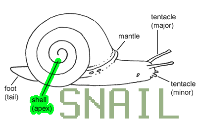

# [SnailJS](//github.com/snailjs/).[Apex](//github.com/snailjs/apex/)


##SnailJS Central data store/provider API

### Simple Example Using Expres.io

```js
var apex = new require("apex-sdk")("admin")
  , email = "user1@domain.org"
  , password = "password"
  , express = require("express.io")
  , app = express().http().io()

//setup apex as middleware
app.use(function(req,res,next){
  api.connect("mysecret",function(err,auth_token){
    if(err) throw err
    api.authorize(auth_token,"staff",email,password,function(err,msg,user_token){
      if(err) throw err
      if(msg) next(msg)
      else {
        req.locals.user_token = user_token
        next()
      }
    })
  })
})

app.listen()
```

### API Reference

#### Authentication

##### Connect

`apex.connect(secret)`

This method should allow Mantle or Foot to supply a secret that will allow it to connect and obtain a special **Authorize Token**. The token is returned to minimize the number times the secret is submitted.

Once an **Authorize Token** is returned it will be required for all other authentication requests which includes user authentication. The **Authorize Token** will only be allowed to connect from the IP that originated the `apex.connect()` call. Only after a user is authorized will they receive a **User Token**

##### Authorize

`apex.authorize(auth_token,collection,id,secret)`

The `authorize` method allows mantle or foot to use an **Authorize Token** to obtain a **User Token** by submitting an id and secret against a named collection.
