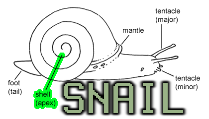

[SnailJS](//github.com/snailjs/).[APX](//github.com/snailjs/apx/)
==========

[](https://travis-ci.org/snailjs/apx)



## APX API Server

APX *(pronounced 'apex')* is a non-opinionated, pluggable, modern API server designed to serve
multiple communication mediums. The core APX plugins rely on popular community packages such as
[express](https://github.com/visionmedia/express),
[kue](https://github.com/learnboost/kue),
[socket.io](https://github.com/learnboost/socket.io),
[winston](https://github.com/flatiron/winston),
[object-manage](https://github.com/snailjs/object-manage)
to make configuration and two-way communication a breeze.

APX is built to be test friendly out of the box and comes with a `testing`
mode in the configuration that will use mock services and increase testing speed.

## Why

Well we have evaluated and contributed to several other API servers and just kept
running into deficiencies, such as failure to use a popular library and not light-weight enough.

Thus, we created APX. It's light-weight, uses lots of modern packages, and wires them all
together in an extensible stateful environment.

## Usage

APX can be used homogeneously or through our
[generator](https://github.com/snailjs/generator-apx).

### Homogeneous
```
$ npm install apx
```

**app.js**

```js
var apx = require('apx')

apx.once('ready',function(){
  console.log('APX is ready!')
})

//pass options and configure
apx.start({
  config: ['config.json'],
  tasks: ['tasks/*.js'],
  initializers: ['apx-kue','apx-mongoose']
  translators: ['apx-express']
  winston: {file: 'foo.log'}
})
```

### Generator

Our [generator](https://github.com/snailjs/generator-apx)
is a [yeoman](https://github.com/yeoman) generator instance
that will scaffold your entire API server.

```
//install the generator
$ npm install generator-apx
//scaffold the initial app
$ yo apx
//scaffold a new action (with test)
$ yo apx:action <name>
//scaffold a new helper (with test)
$ yo apx:helper <name>
//scaffold a new initializer
$ yo apx:initializer <name>
//scaffold a new model
$ yo apx:model <name>
//scaffold a new service (with test)
$ yo apx:service <name>
//scaffold a new test (with test)
$ yo apx:task <name>
//scaffold a new translator
$ yo apx:translator <name>
```

## Structure

APX consists of several well-known idioms

* actions
* helpers
* initializers
* middleware
* models
* services
* tasks
* translators

### Actions

Actions are the bread and butter of an API server they serve all
requests and build responses. Actions are also in charge of firing
non-periodic tasks and utilizing services.

### Helpers

Helpers do not get loaded by the APX loading service however helpers
are meant to be common modules that assist actions and tasks. Generally
these are libraries that augment the `req`,`res` variables.

### Initializers

Initializers get executed when the server starts up and are only executed
once. These are useful for setting up database connections and loading
additional items into the environment.

### Middleware

Middleware is inspired by the idea of Connect Middleware and uses the same
principle format.

Middleware is executed before actions are fired and is passed the **Request** and
**Response** objects for augmentation.

Middleware is also the prescribed location to setup authentication handlers.

### Models

Models are optional, but since using models to store data has become so common
it seems silly not to support them in context and generators. Models do
not get loaded by the APX framework, but can be added during an initializer
or per action or task.

### Services

Services are just libraries that are treated as singletons. Services should
be used to maintain in-memory information, and/or provide access to data providers.
Models are services but services are not necessarily models.

### Tasks

Tasks are jobs which are run either periodically or scheduled to run by an action.
Tasks are considered headless and while they consume request data. They do not
provide response data. They can, however, log using [winston](https://github.com/flatiron/winston).

### Translators

In other frameworks these are sometimes called "servers". Translators are the
middleware that consumes connections and produce generic `Request` and `Response`
objects. An example of a translator would be an *express HTTP server*.

## Plugin Format

All parts of the structure are implemented in plugins. APX follows a simple plugin format
that is similar in all parts of user space. The main APX package only provides the plugin
loader and depends on plugins to add functionality to the system. This allows APX to be
non-opinionated.

#### Plugin Verbs / Nouns

There are a couple common verbs used in plugins.

* **run** -- Used to execute a function on a call event such as an action or task
* **start** -- Used in initializers and translators to start instances / listeners
* **stop** -- Used in initializers and translators to stop instances / listeners, and shutdown cleanly
* **module** -- Used in helpers, models and services to export object to be used

### Actions

```js
exports.name = 'name' //should be concise and match the file name
exports.description = 'description of task' //verbose description for generating maps
exports.run = function(apx,req,res,next){} //code to be executed by apx and fire the next(err) at the end
```

### Helpers

```js
exports.name = 'name' //should be concise and match the file name
exports.description = 'description of model' //verbose description for generating maps
exports.helper = {} //object exported by the helper can also be a constructor
```

### Initializers

```js
exports.name = 'name' //should be concise and match the file name
exports.description = 'description of initializer' //verbose description for generating maps
exports.start = function(apx,next){} //code to be executed to start the initializer, firing next(err) at the end
exports.stop = function(apx,next){} //code to be executed to stop the initializer, firing next(err) at the end
```

### Middleware

```js
exports.name = 'name' //should be concise and match the file name
exports.description = 'description of middleware' //verbose description for generating maps
//pre only
exports.run = function(apx,req,res,next){} //constructor function with a prototype for instantiation (for pre run only)
//-- or --
//pre and post
exports.pre = function(apx,req,res,next){} //run this function before the action
exports.post = function(apx,req,res,next){} //runt this function after the action
```

### Models

```js
exports.name = 'name' //should be concise and match the file name
exports.description = 'description of model' //verbose description for generating maps
exports.schema = {} //schema used to create the model
exports.model = {} //model object created by desired database software
```

### Services

```js
exports.name = 'name' //should be concise and match the file name
exports.description = 'description of service' //verbose description for generating maps
exports.service = function(){} //constructor function with a prototype for instantiation
```

### Translators

```js
exports.name = 'name' //should be concise and match the file name
exports.description = 'description of action or task' //verbose description for generating maps
exports.start = function(apx,next){} //code to be executed to start the translator, firing next(err) at the end
exports.stop = function(apx,next){} //code to be executed to stop the translator, firing next(err) at the end
```

### Tasks

```js
exports.name = 'name' //should be concise and match the file name
exports.description = 'description of task' //verbose description for generating maps
exports.run = function(apx,req,next){} //code to be executed by apx and fire the next(err) at the end
```

## Clustering

Clustering in APX is a breeze. Simply use
[cluster-master](https://github.com/isaacs/cluster-master)

Here is a quick example

**app.js**

```js
var apx = require('./apx')

apx.once('ready',function(apx){
  console.log('APX is ready!',apx)
})

apx.start({
  cwd: __dirname + '/app',
  config: ['config.json'],
  initializers: ['apx-kue'],
  tasks: ['tasks/*.js'],
  translators: ['apx-express-socket.io']
  express: {
    port: 3000
  }
})
```

**server.js**

```js
var clusterMaster = require('cluster-master')

clusterMaster({
  exec: 'app.js',
  env: {NODE_ENV: 'production'},
  repl: {address: '127.0.0.1', port: 3002}
})
```

To start the cluster simply run

```
$ node server
```

## Events

APX is an **EventEmitter** and will emit various actions during its
lifecycle that can be used to hook for additional functionality.

**NOTE** The event emitter for APX is a singleton so be careful when
registering events as they may get fired by more than one instance. Thus,
its important to use the `once` operator on a lot of one-off events. Then
use the `dead` event to re-arm.

### readyStateChange

Fired each time the readyState of the system changes.

```js
var apx = require('apx')
apx.on('readyStateChange',function(readyState){
  console.log('APX changed ready state to ' + readyState)
})
```

The following ready states are supported.

* 0 - Dead (not started or stopped)
* 1 - Ready (completed init and ready to accept operations)
* 2 - Configured (finished configuring and ready to start)
* 3 - Starting (before init actions are fired)
* 4 - Stopping (before shutdown actions are fired)

### error

Fired any time an error occurs.

```js
var apx = require('apx')
apx.on('error',function(err){
  console.log('APX had an error',err)
})
```

### ready

Fired when configuration and init is completed

```js
var apx = require('apx')
apx.on('ready',function(inst){
  console.log('APX is ready',instance)
})
```

The instance after init is passed to the event.

### dead

Fired after shutdown has been completed.

```js
var apx = require('apx')
apx.on('dead',function(inst){
  console.log('APX has died',instance)
})
```

The instance after shutdown is passed to the event.

### runActionBefore

Fired before running an action.

```js
var apx = require('apx')
apx.on('runActionBefore',function(action){
  console.log('APX action before',action)
})
```

The action object is passed to the event.

### runActionAfter

Fired after running an action.

```js
var apx = require('apx')
apx.on('runActionAfter',function(action){
  console.log('APX action after',action)
})
```

The action object is passed to the event.

### runTaskBefore

Fired before running a task.

```js
var apx = require('apx')
apx.on('runTaskBefore',function(task){
  console.log('APX task before',task)
})
```

The task object is passed to the event.

### runTaskAfter

Fired after running a task.

```js
var apx = require('apx')
apx.on('runTaskAfter',function(task){
  console.log('APX task after',task)
})
```

The task object is passed to the event.

**NOTE** the instance is destroyed after this event.

## Configuration

APX uses [object-manage](https://github.com/snailjs/object-manage) to load
and manage configuration data.

This also means the APX instance emits the events from object-manage see below.

[object-manage Events](https://github.com/snailjs/object-manage#events)

### Schema

#### Testing
* Variable `testing`
* Default `false`

Testing mode will use [fakeredis](https://github.com/hdachev/fakeredis)
as much as possible and will not start listening on
any ports. However it will still offer a full featured
environment for writing tests. Testing mode will also
not start Kue which should not be needed to test tasks.

#### CWD (current working directory)
* Variable `cwd`
* Default `''`

The current working directory is used when loading
actions, services, and tasks.

#### Initializers
* Variable `initializers`
* Default `[]`

An array of [globs](https://github.com/isaacs/node-glob)
or objects or absolute file paths. That should be
executed when the server is started.

#### Tasks
* Variable `tasks`
* Default `[]`

An array of [globs](https://github.com/isaacs/node-glob)
or objects or absolute file paths. That will resolve
to tasks.

This must be provided at config time to they can be
loaded into Kue and scheduled if needed.

#### Translators
* Variable `translators`
* Default `[]`

An array of [globs](https://github.com/isaacs/node-glob)
or objects or absolute file paths. That will resolve
to translators that should be started when the
server is started

## Lifecycle API

The lifecycle functions control how APX is started, stopped and configured.

### Setup

Pass configuration parameters and instantiate the library. Does not
start initializers or translators.

```js
apx.setup({
  cwd: __dirname
})
```

### Start

Starts the APX server by starting initializers and translators. Once that is compelte
it fires the `ready` event which is passed the instance of APX.

```js
apx.setup({
  cwd: __dirname
})
apx.start()

//or for more convenience
apx.start({
  cwd: __dirname
})
```

**Note** If no object is passed to start and setup has not been called APX will
throw an exception `Tried to start APX without setting it up`

### Stop

Stops the APX server by stopping initializers and translators. Once that is complete
it fires the `dead` event and destroys the instance.

```js
apx.once('dead',function(){
  console.log('APX is now dead')
})
apx.once('ready',function(){
  apx.stop()
})
apx.start({cwd: __dirname})
```

### Restart

Restart the APX server by stopping initializers and translators and then restarting them.
Stop will fire the `dead` event.
Start will fire the `ready` event.

```js
apx.on('dead',function(){
  console.log('APX is now dead')
})
apx.on('ready',function(){
  console.log('APX is now ready')
})
apx.once('ready',function(){
  apx.restart()
})
apx.start({cwd: __dirname})
```

### Apx

Reference to the Apx constructor and its prototype. Useful for overriding prototypes before startup.

```js
console.log(apx.Apx.prototype.readyState) //0
```

### Instance

The current instance of APX is stored here. This can be use for mocking testing and passing the instance
instead of having APX do it manually.

```js
var initializer = require('apx-mongoose')
initializer.start(apx.instance,function(){
  console.log('Manually started apx-mongoose')
})
```

**Note** the instance will be `null` by default when APX has either yet to be started or after being stopped.

## Request and Response Objects

In APX the request and response objects create the common layer that translators iterate. They are instances of
[object-manage](https://github.com/snailjs/object-manage) and expose all the available methods. These objects,
however, **are not streams**. This is a limitation in some cases but it is the only to make the call stack for
middleware usable.

Nearly all API servers implement commands and it is up to the translator to supply any uploaded files which should
be written to temporary files using a tool like [formiddable](https://github.com/felixge/node-formidable). After
that the action can direct the file to the correct location or transfer it to a storage cluster.

The request and response objects support a file object that points to an incoming temporary file or a file that should
be streamed to a file.

If there is a situation where file support is more important than command support then raw stream iteration should be
implemented in the translator. It is easy to take existing translators and modify them in userspace.

### Request

The request object contains information that is passed along from the request paths from the translator and is supplied
in object notation. Thus, `req.get('propertyName')` is the most common usage to retrieve information. However to allow
for the receiving of files there is a `req.files` array that shall be populated with files that were written to
temporary files during the request.

In order to access parts of the translator for more control over specific access mediums like the HTTP server the raw
request object shall be provided via `req.raw`

Example
```js
exports.name = 'myAction'
exports.description = 'Example Action'
exports.run = function(apx,req,res,next){
  req.get('foo') //bar
  req.raw.query.foo //bar
  res.success()
  next()
}
```

#### Add File

As a convenience for translators to add files to the request object the `addFile()` method exists.

Example
```js
var req = new Request()
req.addFile('foo.txt')
req.addFile('bar.txt')
```

### Response

The response object is built by the action and middleware which is then passed on to the user through the translators
desired output format. In most cases the output format is JSON but this is sometimes configurable at the translator
level.

#### Add Body Content

To allow the sending of raw data rather than JSON or any other format that can be transformed from an object the `add()`
method comes in handy.

Example
```js
exports.name = 'myAction'
exports.description = 'Example Action'
exports.run = function(apx,req,res,next){
  res.add('content to show')
  res.add('more content to show')
  next()
}
```

#### Success

As a convenience method `success()` exists to signal success to the client. This method uses a standard response format.
That resembles the following. Success also accepts an object that gets merged with the pre filled part of the
response.

Format
```json
{"status": "ok", "message": "success"}
```

Example
```js
exports.name = 'myAction'
exports.description = 'Example Action'
exports.run = function(apx,req,res,next){
  res.success({id: 'foo'})
  next()
}
```

#### Error

For easier error handling the error method can be used to pass an erroneous response to the client and accepts a
few different combinations of arguments to supply the user with information about the error.

Format
```json
{"status": "error", "message": "An error has occurred", "code": "1"}
```

Example
```js
exports.name = 'myAction'
exports.description = 'Example Action'
exports.run = function(apx,req,res,next){
  res.error() //sends message: 'An error has occurred', code: '1'
  res.error('foo') //sends message: 'foo', code: '1'
  res.error('foo',4) //send message: 'foo', code: '4'
  res.error('foo',4,{id: 'bar'}) //sends message: 'foo', code: '4', id: 'bar'
  res.error('foo',{id: 'bar'}) //sends message: 'foo', code: '1', id: 'bar'
  res.error({id: 'bar'}) //sends message: 'An error has occurred', code: '1', id: 'bar'
  next()
}
```

#### Send File

Sometimes it is useful to send clients a file thus the `sendFile(path)` method exists. This will notify the translator
that a file should be sent to the user and allows the translator to properly handle streaming the file to the user.

When a file by that path cannot be found it will throw an exception.

**NOTE** Whenever this method is called it will supersede any other output that has been queued to be sent to the user
by using `add()` or `set()`. Unless the translator is capable of sending multipart responses.

Example
```js
exports.name = 'myAction'
exports.description = 'Example Action'
exports.run = function(apx,req,res,next){
  res.sendFile('home.html')
  next()
}
```

###

## Changelog

### 0.6.0
* Request objects now implement the file object
* Response objects now implement the file object
* Response.send() deprecated in favor of the existing **object-manage** functions
* In order to support pre and post middleware translators need to fire the Response.render() method and then send
the rendered response to their client
* Upgraded middleware, model, service and helper format
* Added `Response.sendFile(path)` to allow sending of files to the user. Using this method still requires calling `next()`
and will supersede any existing output.

### 0.5.0

* Implementation of APX authentication system [#3](https://github.com/snailjs/apx/issues/3)
* APX now loads packages exactly like Node's `require()`. Except for the addition of parsing
globs. [see this](http://nodejs.org/api/modules.html#modules_loading_from_node_modules_folders)
* Middleware now supports `pre` and `post` actions with a default of `run` which will be fired before
the action.

### 0.4.0
* Usage no longer involves `new Apx` the returned object is now an event emitter
* Changed lifecycle management and abstract usage of the APX library. This changes
usage of APX and will require upgrading.
* SysLog added for core level logging. Winston should be used for user-space logging.
* Kue removed from core package and abstracted to [apx-kue](https://github.com/snailjs/apx-kue)
* Winston removed from core package and abstracted to [apx-winston](https://github.com/snailjs/apx-winston)
* Tasks are no longer initialized by the core should be implemented in an initializer
* Updated plugin format (this means existing initializer/translator/service plugins will need to upgrade) see the README
for the prescribed plugin format.
* Added `'use strict';` statements to all files and removed testing init file
* APX is now an event emitter and `onReady` has been removed see README for events
* Response object no longer accepts a callback and actions should fire next explictly with any errors. See
plugin format in the README for details.
* Added the idea of middleware that is executed in order before each action process.

### 0.3.4
* Updated to **object-manage** 0.4.0
* Restored `Request.data` and `Response.data` as references to the managed objects.
* Fixed issue with tasks being passed the entire `job` object instead of `job.data`

### 0.3.3
* Updated to **object-manage** 0.3.0

### 0.3.2
* Final fix for redis in testing mode

### 0.3.1
* Fixed using real redis during testing mode

### 0.3.0
* Fixes [#2](https://github.com/snailjs/apx/issues/1) - Objects are now disallowed from being passed to the config
* Loading framework now more async friendly
* Init is handled completely async
* Fixed minor issue with Response object not rendering JSON properly
* Removed unused dependencies
* Updated object-manage upstream

### 0.2.1
* Fixes [#1](https://github.com/snailjs/apx/issues/1) - Fails when loading required translator

### 0.2.0
* Dropped convict in favor of object-manage

### 0.1.0
* Initial release
